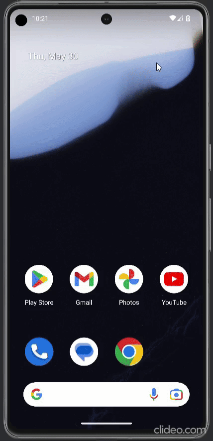

# Game for GAS IR

This app is designed for newly hired Data Entry Specialists, specifically
Image Reviewers (IR), at Global Agility Solutions (GAS). As a former IR at GAS, I
conceived the idea of creating an application intended to assist new IRs in memorizing
the abbreviations, nicknames, and license plates of specific US states.

Disclaimer: I was not paid by GAS to build this project. This is a self-initiated project.

💻 Requirements
------------
To try out this application, you need to use [Android Studio](https://developer.android.com/studio).
You can clone this repository, import the project from Android Studio, or download its APK file [here](https://drive.google.com/file/d/1V2od2P5r6CwxoITo1DeFBq7RThasw629/view?usp=sharing).